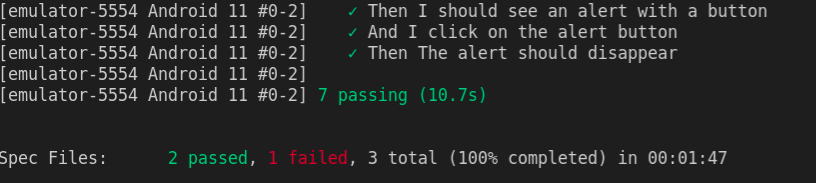
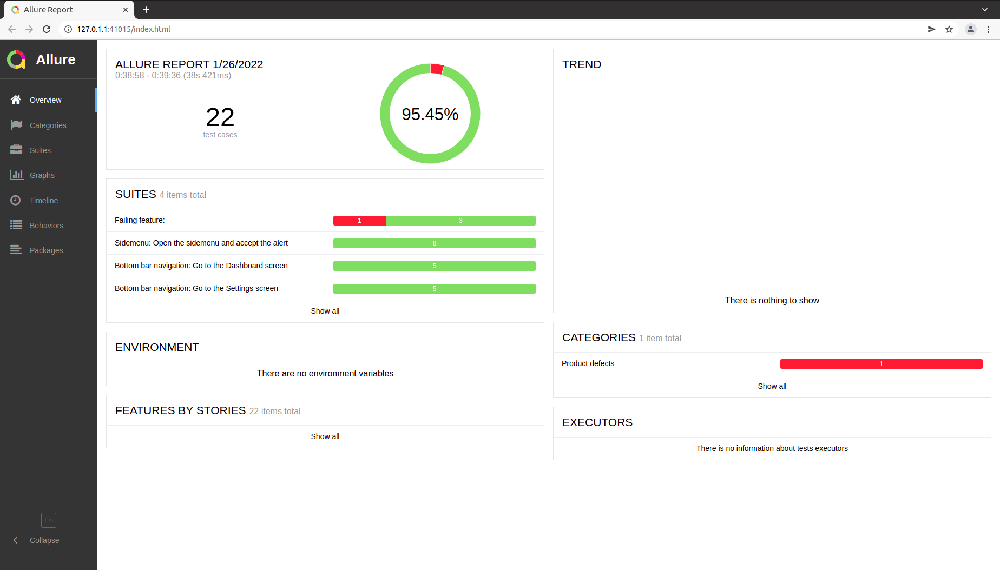
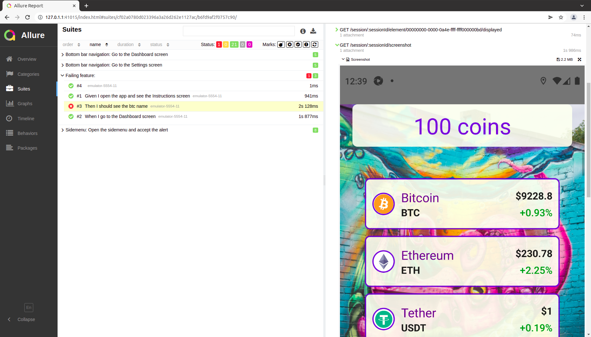

# Appium Automation

## Description
This repository contains a basic setup for testing an Android and iOS application using Appium, WebDriverIO and Cucumber.

The project is structured with three main folders:

- Apps - Contains the applications to be tested;
- Config - Contains the WebDriverIO configuration files;
- Features - Contains the tests and the necessary code to support them.

There is also a `package.json` file with all of the project dependencies.

## Configurations

WebDriverIO is a JavaScript client for Appium. It offers out-of-the-box support to Appium and Cucumber. 
The main WebDriverIO configurations (the ones that serve Android and iOS) are on the file `config/wdio.conf.js`. The platform specific capabilities are then defined on a specific platform file: for `Android` on the `config/wdio.android.conf.js` and for `iOS` on the `wdio.ios.conf.js`. 
For running the tests, please make sure you have the simulator/emulator defined on each of these files.

## Tests

The tests are written using Cucumber BDD. They are defined with the Gherkin syntax on the `feature` files and then implemented under the `step-definitions` folder on the `.steps` files. 

The page object model is also implemented for the different app screens and components. On each screen object only the components used were declared. The idea is that as the tests evolve, the remaining selectors and components can be added. 

For the selectors, I believe that on this app multiple `testIDs` were defined, however, due to [this](https://github.com/facebook/react-native/issues/32237) issue, I believe they are not being correcly mapped for the `Accessibility ID` locator strategy to be effective for Android (for iOS it should work well). For Android I chose the `UI Automator Selector` due to the simplicity of retrieving the elements with the resource-id with it and it is more stable than other strategies such as XPath. For iOS, the `testIDs` should always be used with the exception of native components (eg. Alert) that does not have custom `testIDs` defined and can be accessed via `ios predicate`. 

To facilitate the process of having two different locator strategies, a helper function was created that basically builds the selector as it is expected for each platform. Every Screen Object makes use of this helper with the exception of the Alert for iOS due to the reasons stated.

The assertion library chosen is the WebDriverIO assertion library because it is powerful and comes for free with the WebDriverIO integration.

The `afterStep` hook is being used to take screenshots everytime one step fails. These screenshots are then available on the Allure Report.

Finally, the results should look like bellow because one on the tests is failing on purpose so the screenshot mechanism can be validated too.

Finally, please take the iOS configurations with a grain of salt. I created them just for fun, unfortunately I don't have the hardware to validate them :) 

## How to run

### Android

1. Make sure you have the correct emulator created: `Pixel_5_API_30`. If you prefer to use another, please change it on the `config/wdio.android.conf.js` on the `avd` setting;

2. Install the dependencies:
    >  $ yarn install

3. Run the tests:
    > $ yarn test:android

4. Generate the report:
    > $ yarn generate:report

5. Open the report 
    > $ yarn open:report
